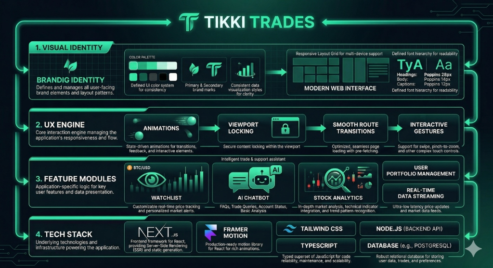
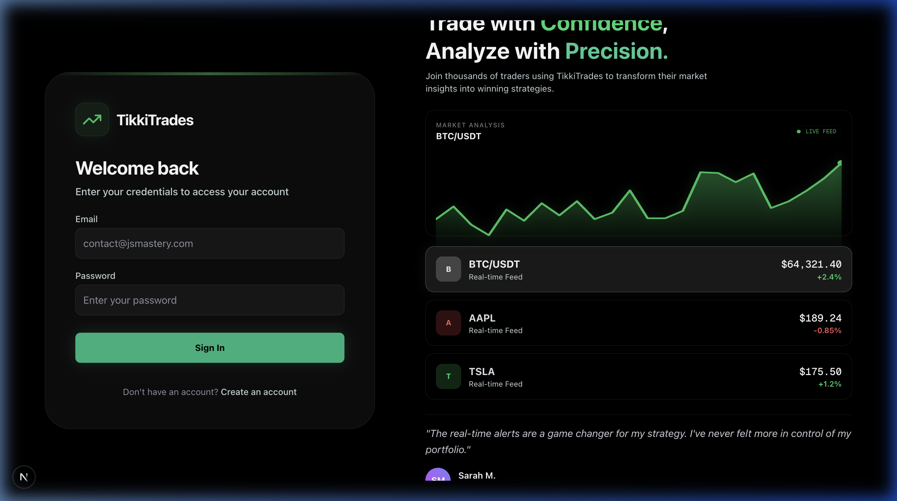
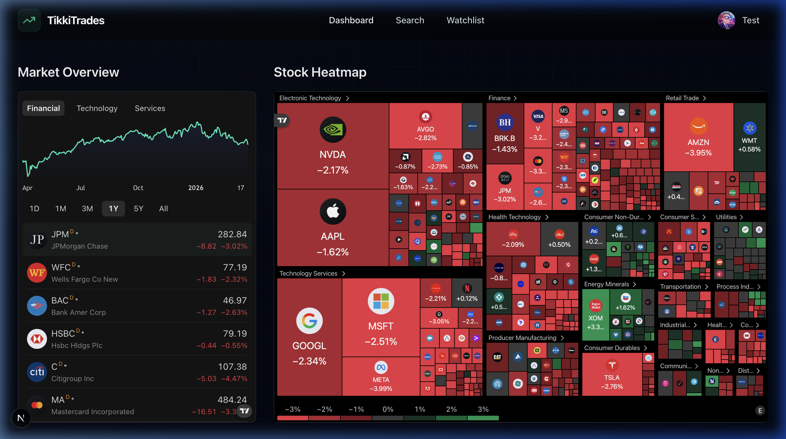
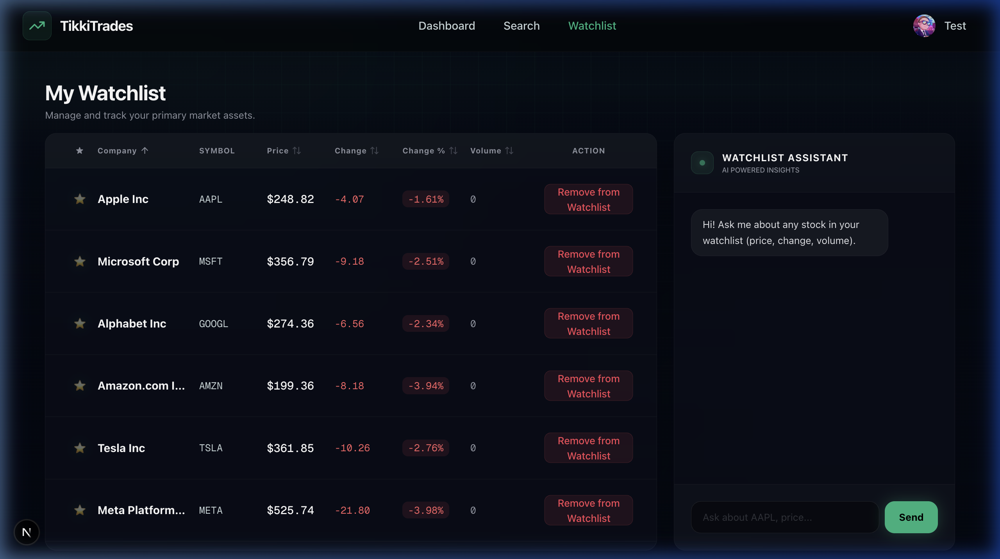
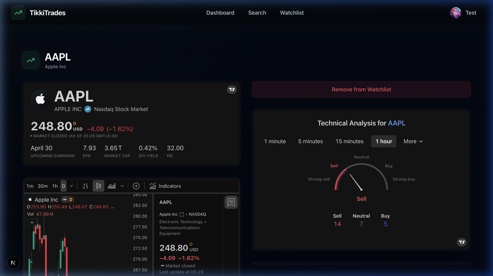

# 💹 Tikki Trades - Premium Market Analytics Platform

Tikki Trades is a **production-ready financial terminal** designed for modern traders. It leverages **Next.js 15**, **Framer Motion**, and **TradingView Intelligence** to deliver a high-performance, interactive, and visually stunning market analysis experience.


> **🏆 Premium Trading Terminal - Complete UI/UX Overhaul**  
> Rebranded from legacy systems to a cohesive "Emerald-on-Black" aesthetic with a 100% viewport-optimized layout and AI-powered insights.

## 🏁 Full Platform Walkthrough

Experience the complete user journey from authentication to deep market analytics:


---

## 🎯 Platform System Architecture

Tikki Trades is built on a modular, multi-layered architecture designed for visual excellence and real-time financial data processing:



### **1. Visual Identity Layer**
- **Brand Identity**: Defines and manages all user-facing brand elements and layout patterns.
- **Color Palette**: A curated emerald-on-black system (`#10b981`) for professional financial aesthetics.
- **Modern Web Interface**: Responsive layout grid with defined font hierarchy (`Poppins` for headings/body) to ensure readability across devices.

### **2. UX Engine Layer**
- **Orchestrated Animations**: State-driven transitions, feedback, and interactive elements powered by Framer Motion.
- **Viewport Locking**: Strict content locking within the viewport to maintain a native "app-like" feel on desktop.
- **Smooth Transitions**: Optimized, seamless page loading with pre-fetching for rapid navigation.

### **3. Feature Modules Layer**
- **Watchlist Intelligence**: Customizable real-time price tracking with personalized market alerts and optimistic UI updates.
- **AI Chatbot**: Intelligent trade and support assistant for FAQs and trade queries.
- **Stock Analytics**: In-depth market analysis with technical indicator integration and pattern recognition.
- **Portfolio Management**: User-centric data streaming for ultra-low latency price updates.

---

## 🚀 Core Features & Implementation

| Feature                              | Implementation Details                                                                 | Status |
| ------------------------------------ | -------------------------------------------------------------------------------------- | ------ |
| **🎨 Emerald Rebranding**             | 100% theme unification with custom CSS variables and UI tokens                        | ✅      |
| **📏 Viewport Excellence**           | Dashboard layouts locked to `h-screen` to prevent scrolling fatigue                    | ✅      |
| **✨ Staggered Orchestration**       | Premium entrance animations (Container/Item variants) for all form fields              | ✅      |
| **🤖 AI Sidebar Assistant**          | Context-aware chatbot with auto-scrolling conversation history                         | ✅      |
| **🌐 Global Grid Background**        | Interactive, pulsing grid system consistent across all application routes              | ✅      |
| **📈 Technical Analytics**           | Real-time gauge indicators and technical analysis summaries on stock pages             | ✅      |
| **🗂️ Optimistic UI**                | Instant feedback on asset removal with slide-out animation transitions                | ✅      |
| **🛠️ Hydration Stability**           | Resolved all server/client boundary mismatches for production stability                | ✅      |

---

## 🛠️ Tech Stack

```
Framework:        Next.js 15 (App Router)
Styling:          Tailwind CSS (Glassmorphism & Custom Tokens)
Animations:       Framer Motion (Orchestrated Staggers & Exits)
Icons:            Lucide React
State Management: React Hooks (useState, useEffect, useRef)
Market Data:      TradingView Embedded Analytics
Deployment:       Vercel Ready
```

---

## 📋 Architecture: How It Works

### 1. Viewport Locking & Layout
The platform uses a strict viewport-locking strategy to provide a native desktop application experience:

```
[ Root Layout ]
      ↓
[ AnimatedBackground (Global Grid) ]
      ↓
[ Main Container (h-[calc(100vh-OFFSET)] overflow-hidden) ]
      ┌─────────────┴─────────────┐
      ↓                           ↓
[ Left: Scrollable Table ]  [ Right: Scrollable Chatbot ]
```

### 2. Framer Motion Orchestration
Authentication and Stock pages use staggered animation variants to guide the user's eye:
- **Title**: `y: -20, opacity: 0` → `y: 0, opacity: 1`
- **Inputs**: Delayed by `0.1s` intervals
- **CTA Button**: Scale effect on hover, delayed by `0.3s`

### 3. AI Sidebar Interaction
The "Watchlist Assistant" uses a `useRef` based auto-scroll hook to ensure the conversation remains current:
```javascript
useEffect(() => {
  if (scrollRef.current) {
    scrollRef.current.scrollTop = scrollRef.current.scrollHeight;
  }
}, [messages]);
```

---

## 📸 Visual Gallery

````carousel

<!-- slide -->

<!-- slide -->

<!-- slide -->

````

---

## 📦 Installation

### 1. Clone & Install
```bash
git clone https://github.com/techieadi4703/tikki-trades.git
cd tikki-trades
npm install
```

### 2. Configure Environment
Create a `.env.local` file and add your necessary API keys (if applicable for data providers).

### 3. Launch Development Server
```bash
npm run dev
```
Platform available at: `http://localhost:3000`

---

## 💡 Business Impact

- 🚀 **First Impression**: Premium staggered animations increase perceived platform quality.
- ⚙️ **Efficiency**: Viewport-locked dashboards allow for faster data scanning without scrolling fatigue.
- 😊 **User Retention**: Interactive AI sidebars provide immediate value-add for asset analysis.

---

**Built with ❤️ for Modern Traders by Tikki Trades Team**
