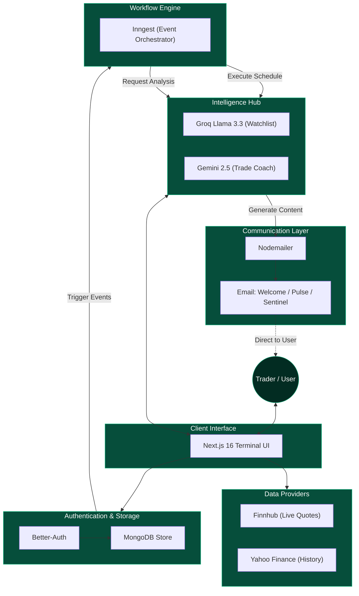
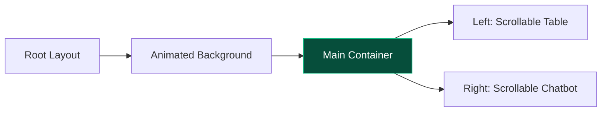

# 💹 Tikki Trades - Premium Market Analytics Platform

Tikki Trades is a **production-ready financial terminal** designed for modern traders. It leverages **Next.js 16**, **Framer Motion**, and **Multi-LLM Intelligence** (Gemini & Groq) to deliver a high-performance, interactive, and visually stunning market analysis experience.


> **🏆 Premium Trading Terminal - Complete AI-First Overhaul**  
> Rebranded to a cohesive "Emerald-on-Black" aesthetic with a 100% viewport-optimized layout and professional-grade AI coaching.

## 🏁 Full Platform Walkthrough

Experience the complete user journey from authentication to deep market analytics:


---

## 🎯 Platform System Architecture

Tikki Trades is built on a modular, multi-layered architecture designed for visual excellence and real-time financial data processing.



### **1. Visual Identity Layer**
- **Modern Web Interface**: Responsive layout grid with the **Geist** font family (Sans/Mono) for high-performance readability.
- **Color Palette**: A curated emerald-on-black system (`#10b981`) for professional financial aesthetics.

### **2. UX Engine Layer**
- **Orchestrated Animations**: State-driven transitions and interactive elements powered by Framer Motion.
- **Viewport Locking**: Strict content locking within the viewport to maintain a native "app-like" feel on desktop.

### **3. Feature Modules Layer**
- **Watchlist Assistant**: Real-time asset queries and market analysis powered by **Groq (Llama 3.3 70B)**.
- **AI Trade Coach**: Intelligent trade journaling and bias detection powered by **Gemini 2.5 Flash**.
- **Portfolio Intelligence**: Real-time holding tracking with unrealized PnL analysis and growth metrics.
- **Intelligent Mail Alerts**: Personalized onboarding, daily summaries, and 15-minute price sentinel alerts.
- **Technical Analytics**: Professional-grade charting and gauge indicators via **TradingView** and **Yahoo Finance**.

---

## 🚀 Core Features & Implementation

| Feature                              | Implementation Details                                                                 | Status |
| ------------------------------------ | -------------------------------------------------------------------------------------- | ------ |
| **🎨 Emerald Rebranding**             | 100% theme unification with custom CSS variables and Tailwind 4 tokens                | ✅      |
| **🧠 AI Trade Coach**                | Direct-to-Gemini integration for unbiased trade journal reviews and thesis scoring     | ✅      |
| **💬 Watchlist Assistant**           | Context-aware asset queries powered by Groq (Llama 3.3 70B) for instant market news    | ✅      |
| **📬 Smart Alerts**                  | AI-personalized emails, price triggers, and daily market pulses via Inngest           | ✅      |
| **💼 Portfolio Tracker**             | Live PnL analysis with real-time price updates via Finnhub/Yahoo Finance               | ✅      |
| **📈 Technical Analytics**           | Real-time gauge indicators and technical analysis summaries on stock pages             | ✅      |
| **🛠️ Framework Excellence**          | Next.js 16 (App Router) + React 19 for maximum performance and hydration stability    | ✅      |

---

## 🛠️ Tech Stack

- **Framework**: [Next.js 16](https://nextjs.org/) (App Router)
- **Runtime**: [React 19](https://react.dev/) (Server Components & Actions)
- **Styling**: [Tailwind CSS 4](https://tailwindcss.com/) (Modern JIT Engine)
- **Animations**: [Framer Motion](https://www.framer.com/motion/)
- **AI Engines**: [Gemini 2.5 Flash](https://deepmind.google/technologies/gemini/), [Groq (Llama 3.3 70B)](https://groq.com/)
- **Market Data**: [Finnhub API](https://finnhub.io/), [Yahoo Finance](https://github.com/gadicc/node-yahoo-finance2)
- **Database**: [MongoDB](https://www.mongodb.com/) with [Mongoose](https://mongoosejs.com/)
- **Auth**: [Better-Auth](https://www.better-auth.com/) (Secure DB Sessions)
- **Orchestration**: [Inngest](https://www.inngest.com/) (Serverless Queues & Crons)

---

## 📋 Architecture: How It Works

### 1. Viewport Locking & Layout
The platform uses a strict viewport-locking strategy to provide a native desktop application experience:



### 2. Intelligent Mail Alerts (Inngest & Nodemailer)
The "Heartbeat" of the platform is an event-driven automation engine:
- **Personalized Onboarding**: Automatically triggers a welcome email where Gemini introduces the user to the terminal based on their specific goals.
- **Daily Market Pulse**: Scheduled every day at 12:00 PM UTC to send AI-summarized news for all symbols in a user's watchlist.
- **Price Sentinel**: A 15-minute cron job that monitors market prices against user-defined targets, triggering immediate email and in-app notifications.

### 3. Framer Motion Orchestration
Authentication and Stock pages use staggered animation variants to guide the user's eye:
- **Title**: `y: -20, opacity: 0` → `y: 0, opacity: 1`
- **Inputs**: Delayed by `0.1s` intervals
- **CTA Button**: Scale effect on hover, delayed by `0.3s`

### 4. AI Sidebar Interaction (Groq & Llama 3.3)
The "Watchlist Assistant" leverages **Groq's Llama 3.3 70B** model via its high-performance OpenAI-compatible endpoint. It provides near-instantaneous analysis of watchlist data, using a `useRef` based auto-scroll hook to ensure the conversation remains fluid:
```javascript
useEffect(() => {
  if (scrollRef.current) {
    scrollRef.current.scrollTop = scrollRef.current.scrollHeight;
  }
}, [messages]);
```

---

## 📸 Visual Gallery

### **Premium Sign In Experience**


### **Market Dashboard & Heatmaps**


### **Viewport-Locked Watchlist**


### **Stock Pulse Analytics**


---

## 📦 Installation

1. **Clone & Install**
   ```bash
   git clone https://github.com/techieadi4703/tikki-trades.git
   cd tikki-trades
   npm install
   ```

2. **Configure Environment**
   Create a `.env.local` file and add the following keys:
   ```bash
   NEXT_PUBLIC_FINNHUB_API_KEY=your_key
   GEMINI_API_KEY=your_key
   GROQ_API_KEY=your_key
   MONGODB_URI=your_uri
   BETTER_AUTH_SECRET=your_secret
   BETTER_AUTH_URL=http://localhost:3000
   NODEMAILER_EMAIL=your_email
   NODEMAILER_PASSWORD=your_password
   ```

3. **Launch**
   ```bash
   npm run dev
   ```
   Platform available at: `http://localhost:3000`

---

## ⚙️ Technical Deep Dive

### **1. Identity & Security (Better-Auth)**
Tikki Trades uses **Better-Auth** for a secure, database-backed authentication system. It handles:
- **Session Management**: Persistent, secure sessions across browser restarts.
- **Account Security**: Encrypted password hashing and protected API routes.
- **Lifecycle Events**: Hooks into the signup process to trigger onboarding workflows.

### **2. Background Orchestration (Inngest)**
The platform's "brain" for asynchronous tasks is **Inngest**, which handles:
- **Daily Market Summary**: A scheduled job that fetches personalized news for each user at 12:00 PM UTC.
- **Onboarding Intelligence**: Event-driven emails triggered when a new user signs up, utilizing **Gemini AI** to personalize the welcome message based on the user's investment goals.
- **Reliability**: Automatic retries and event-driven architecture ensure no data is lost during network blips.

### **3. Market Data & Portfolio (Finnhub & Yahoo Finance)**
The platform uses a hybrid approach to ensure reliable, high-fidelity data:
- **Finnhub**: Provides the primary news stream, ticker sentiment, and real-time quote hooks.
- **Yahoo Finance**: Integrated via `node-yahoo-finance2` for robust historical data and deep asset profiling.
- **Portfolio Persistence**: User holdings are managed through a **Mongoose** schema in MongoDB, with real-time unrealized PnL calculation on the server.

### **4. AI Trade Coach (Gemini 2.5 Flash)**
The "Journaling" engine utilizes **Gemini 2.5 Flash** to provide objective feedback on user trades:
- **Bias Detection**: Automatically identifies common emotional pitfalls like FOMO or Revenge Trading.
- **Thesis Scoring**: Scores the strength of the user's investment logic on a scale of 1-10.
- **Risk Mitigation**: Highlights potential risks the user might have ignored based on market context.

### **5. Interactive Analytics (TradingView)**
We utilize the high-performance **TradingView Widget Ecosystem** for:
- **Advanced Charting**: Professional-grade candle and baseline charts.
- **Market Heatmaps**: Sector-specific visualizations of market cap and daily changes.
- **Technical Gauges**: Real-time technical analysis indicators (Oscillators, Moving Averages) for "Buy/Sell" sentiment.
- **Fundamentals**: Direct integration of company financial summaries and balance sheet data.

---

## 💡 Business Impact

- 🚀 **First Impression**: Premium staggered animations and Geist typography increase perceived platform quality.
- ⚙️ **Efficiency**: Viewport-locked dashboards and Tailwind 4's P3 color engine allow for high-focus data scanning.
- 🧠 **Psychological Edge**: AI coaching provides users with a layer of objective feedback to improve emotional resilience.

---

**Built with ❤️ for Modern Traders by techieadi4703**
