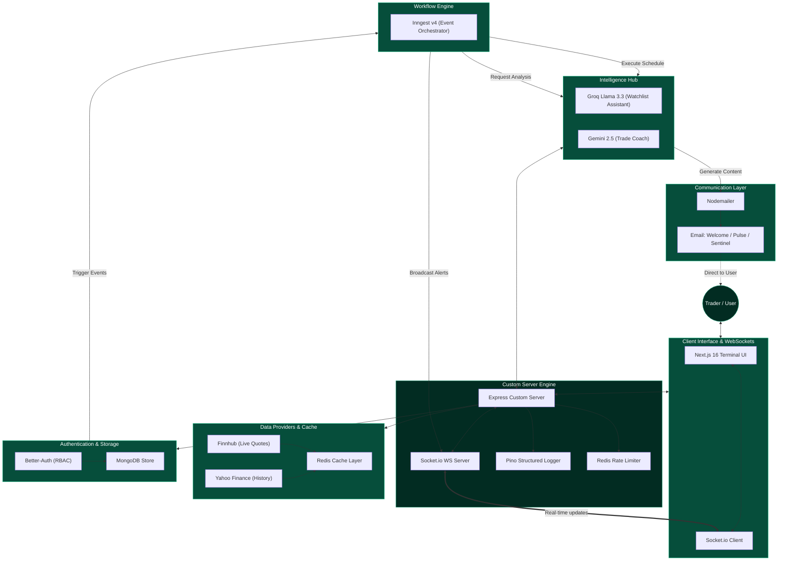
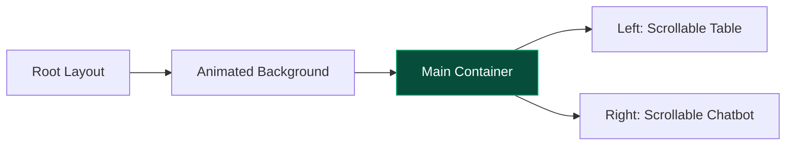
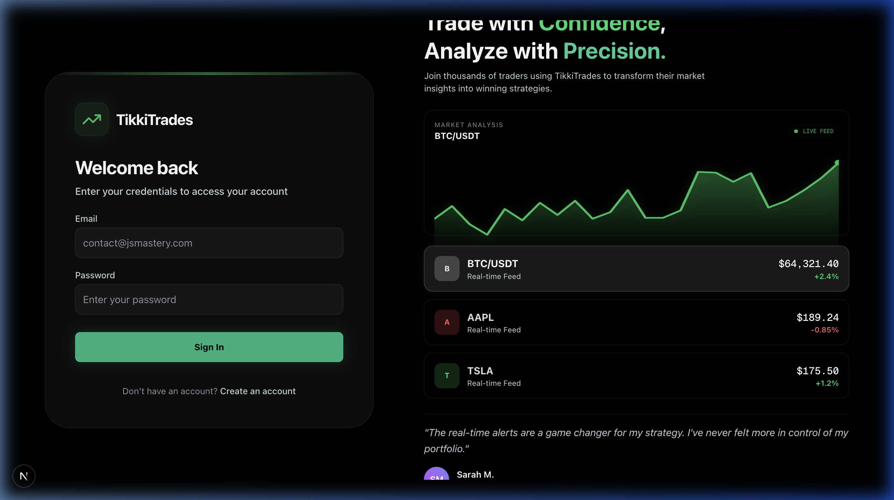
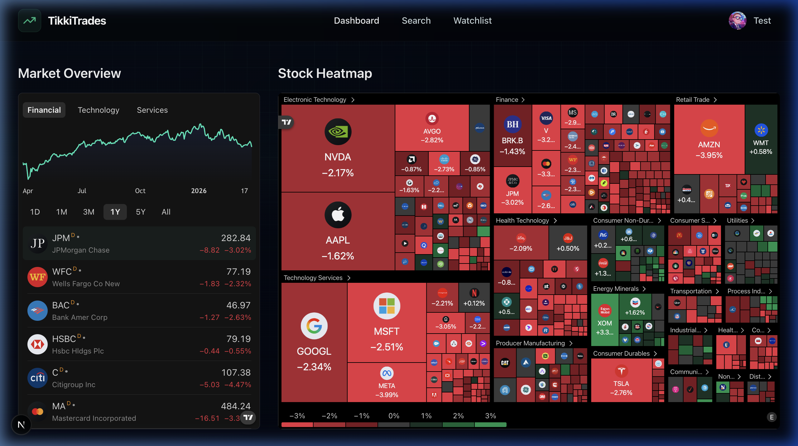
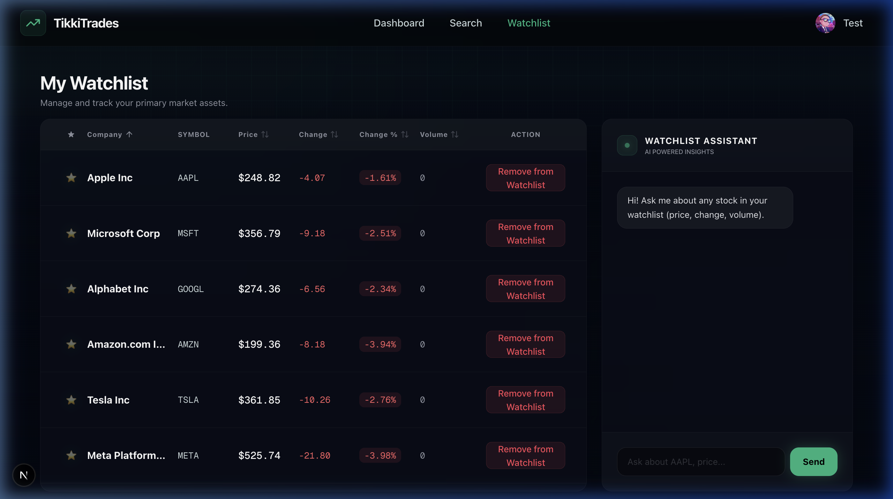
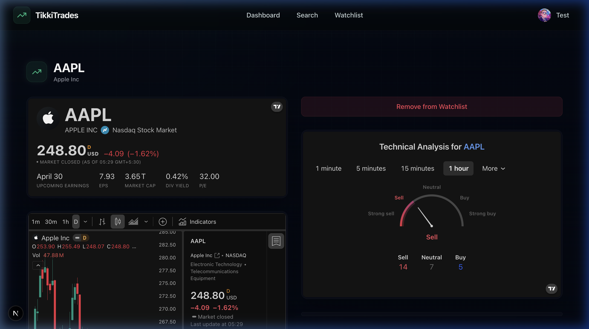

# 💹 Tikki Trades - Premium Market Analytics Platform

Tikki Trades is a **production-ready financial terminal** designed for modern traders. It leverages **Next.js 16**, **Framer Motion**, and **Multi-LLM Intelligence** (Gemini & Groq) to deliver a high-performance, interactive, and visually stunning market analysis experience.

> **🏆 Premium Trading Terminal - Complete AI-First Overhaul**  
> Rebranded to a cohesive "Emerald-on-Black" aesthetic with a 100% viewport-optimized layout, real-time WebSocket communication, Redis-backed intelligence caching, role-based security, and production-grade Docker/Sentry observability.

## 🏁 Full Platform Walkthrough

Experience the complete user journey from authentication to deep market analytics:


---

## 🎯 Platform System Architecture

Tikki Trades is built on a modular, multi-layered architecture designed for visual excellence, real-time financial data processing, and enterprise-grade resilience.


```mermaid
graph TD
    %% Node Definitions
    Trader((Trader / User))
    
    subgraph IH [Intelligence Hub]
        Groq["Groq Llama 3.3 (Watchlist Assistant)"]
        Gemini["Gemini 2.5 (Trade Coach)"]
    end

    subgraph CL [Communication Layer]
        Nodemailer["Nodemailer"]
        Emails["Email: Welcome / Pulse / Sentinel"]
        Nodemailer --> Emails
    end

    subgraph CI [Client Interface & WebSockets]
        NextJS["Next.js 16 Terminal UI"]
        SocketIO["Socket.io Client"]
        NextJS <--> SocketIO
    end

    subgraph SRV [Custom Server Engine]
        ExpressSRV["Express Custom Server"]
        SocketServer["Socket.io WS Server"]
        PinoLogger["Pino Structured Logger"]
        RedisLimit["Redis Rate Limiter"]
        ExpressSRV <--> SocketServer
        ExpressSRV --> PinoLogger
        ExpressSRV --> RedisLimit
    end

    subgraph DP [Data Providers & Cache]
        Finnhub["Finnhub (Live Quotes)"]
        Yahoo["Yahoo Finance (History)"]
        RedisCache["Redis Cache Layer"]
        Finnhub --> RedisCache
        Yahoo --> RedisCache
    end

    subgraph AS [Authentication & Storage]
        BetterAuth["Better-Auth (RBAC)"]
        MongoDB["MongoDB Store"]
        BetterAuth --> MongoDB
    end

    subgraph WE [Workflow Engine]
        Inngest["Inngest v4 (Event Orchestrator)"]
    end

    %% Interaction Flows
    Trader <--> CI
    CI <--> ExpressSRV
    SocketServer <== "Real-time updates" ==> SocketIO
    ExpressSRV --> AS
    ExpressSRV --> DP
    ExpressSRV <--> IH
    
    IH -- "Generate Content" --> Nodemailer
    Emails -. "Direct to User" .-> Trader
    
    AS -- "Trigger Events" --> WE
    WE -- "Execute Schedule" --> IH
    WE -- "Request Analysis" --> IH
    WE -- "Broadcast Alerts" --> SocketServer

    %% Styling
    style IH fill:#064e3b,stroke:#10b981,color:#fff
    style CL fill:#064e3b,stroke:#10b981,color:#fff
    style CI fill:#064e3b,stroke:#10b981,color:#fff
    style SRV fill:#022c22,stroke:#059669,color:#fff
    style DP fill:#064e3b,stroke:#10b981,color:#fff
    style AS fill:#064e3b,stroke:#10b981,color:#fff
    style WE fill:#064e3b,stroke:#10b981,color:#fff
    style Trader fill:#022c22,stroke:#059669,color:#fff
```

### **1. Visual Identity Layer**
- **Modern Web Interface**: Responsive layout grid with the **Geist** font family (Sans/Mono) for high-performance readability.
- **Color Palette**: A curated emerald-on-black system (`#10b981`) for professional financial aesthetics.

### **2. Custom Server & WebSocket Layer**
- **Express Custom Server**: Configured via [server.js](file:///Users/adityasrivastava/Desktop/Projects/tikki-trades/server.js) to bridge HTTP REST routes and Next.js page generation.
- **Socket.io Integration**: Provides stateful room connections for stock details (`stock:${symbol}`) and user portfolio updates (`portfolio:${userId}`).
- **Pino Observability**: Standardized JSON structured logging with custom request tracing using `x-request-id` header extraction.

### **3. Distributed Caching & Rate Limiting**
- **Redis Cache Client**: Managed via [lib/redis/index.ts](file:///Users/adityasrivastava/Desktop/Projects/tikki-trades/lib/redis/index.ts). Caches external stock profiles, prices, and basic metrics.
- **AI Query Hashing**: MD5-hashes user chatbot history and context, avoiding duplicate expensive calls to Groq API endpoints.
- **API Rate Limiter**: Uses `rate-limit-redis` to guard `/api` endpoints from automated scrapers or DDOS vectors.

### **4. Security (RBAC) & Testing**
- **Role-Based Routing**: Restricts administrative or premium features (e.g., [AI Trade Journal](file:///Users/adityasrivastava/Desktop/Projects/tikki-trades/app/(root)/journal/page.tsx)) to validated roles (`Premium User`, `Admin`) via custom session checking in [lib/rbac.ts](file:///Users/adityasrivastava/Desktop/Projects/tikki-trades/lib/rbac.ts).
- **Centralized Formulas**: Math calculations for stock valuations, average cost, and percentage profit calculations are centralized in [lib/portfolio-math.ts](file:///Users/adityasrivastava/Desktop/Projects/tikki-trades/lib/portfolio-math.ts) and fully tested via [lib/portfolio-math.test.ts](file:///Users/adityasrivastava/Desktop/Projects/tikki-trades/lib/portfolio-math.test.ts).

---

## 🚀 Core Features & Implementation

| Feature                              | Implementation Details | Status |
| ------------------------------------ | ---------------------- | ------ |
| **🎨 Theme Unification**             | Curated emerald-on-black branding with strict styling tokens. | ✅ |
| **🧠 AI Trade Coach**                | Direct-to-Gemini (Flash) journal analyzer with behavioral bias checks. | ✅ |
| **💬 Watchlist Assistant**           | Fast chat queries with Groq (Llama 3.3 70B) utilizing Redis caching. | ✅ |
| **📬 Smart Alerts**                  | Personal onboarding, daily news pulse, and price sentinel crons via Inngest v4. | ✅ |
| **💼 Portfolio Tracker**             | Live portfolio calculations using centralized math and cached price quotes. | ✅ |
| **📈 WebSocket Streaming**           | Client-server real-time updates for active alerts and data streams via Socket.io. | ✅ |
| **🔐 Role-Based Access Control**     | Secure access rules mapping Users, Premium Users, and Admins to premium resources. | ✅ |
| **🛠️ Framework Excellence**          | Next.js 16, React 19, Tailwind CSS 4, and Pino HTTP logger integration. | ✅ |

---

## 🛠️ Tech Stack

- **Framework**: [Next.js 16](https://nextjs.org/) (App Router & Server Actions)
- **Runtime**: [React 19](https://react.dev/)
- **Styling**: [Tailwind CSS 4](https://tailwindcss.com/)
- **Animations**: [Framer Motion](https://www.framer.com/motion/)
- **AI Engines**: [Gemini 2.5 Flash](https://deepmind.google/technologies/gemini/), [Groq (Llama 3.3 70B)](https://groq.com/)
- **Sockets**: [Socket.io](https://socket.io/) (Real-time bidirectional communication)
- **Caching & Rate Limiting**: [Redis](https://redis.io/) via `ioredis` & `rate-limit-redis`
- **Telemetry**: [Sentry APM](https://sentry.io/) (Error reporting and replay analysis)
- **Database**: [MongoDB](https://www.mongodb.com/) via `mongoose`
- **Auth**: [Better-Auth](https://www.better-auth.com/)
- **Orchestration**: [Inngest v4](https://www.inngest.com/)

---

## 📋 Architecture: How It Works

### 1. Viewport Locking & Layout
The platform uses a strict viewport-locking strategy to provide a native desktop application experience:


```mermaid
graph LR
    A[Root Layout] --> B[Animated Background]
    B --> C[Main Container]
    C --> D[Left: Scrollable Table]
    C --> E[Right: Scrollable Chatbot]
    style C fill:#064e3b,stroke:#10b981,color:#fff
```

### 2. Custom Node.js Server & WebSockets
Instead of running Next.js as a stand-alone server, we bootstrap a custom Express server. This allows us to load a persistent, unified Socket.io WebSocket server, rate-limit API calls at the routing layer, and wire up Pino logs:
- **Client Subscription**: When a user opens a stock page, the client [SocketProvider](file:///Users/adityasrivastava/Desktop/Projects/tikki-trades/components/providers/SocketProvider.tsx) connects and joins a socket room for that symbol (`stock:AAPL`).
- **Alert Dispatch**: Once Inngest triggers a price alert, the custom server grabs the socket reference (`global.io`) and emits `alert:triggered` directly to the active user's room (`portfolio:${userId}`).

### 3. Redis Intelligence Caching
Every financial query (Finnhub API quotes, historical metrics, company summaries) is wrapped in our caching system. The cached results are stored in Redis:
```typescript
// Example from lib/redis/index.ts
export async function fetchWithCache<T>(
  key: string,
  fetchFn: () => Promise<T>,
  ttlSeconds: number = 300
): Promise<T>;
```
- **Market Data TTL**: Stock quotes are cached for `30 seconds` to ensure up-to-date pricing while protecting API limits. General company info and fundamentals are cached for `24 hours`.
- **Groq Cache**: User queries to the Watchlist Assistant are cached using a composite MD5 hash of the chat history and query, preventing repetitive model inference calls.

### 4. Background Automation (Inngest v4)
Background workflows are orchestrated inside [lib/inngest/functions.ts](file:///Users/adityasrivastava/Desktop/Projects/tikki-trades/lib/inngest/functions.ts):
- **Personalized Onboarding**: Triggers when a user signs up. Generates a custom welcome message using Gemini 2.5 Flash Lite (`gemini-2.5-flash-lite`) and delivers it via Nodemailer.
- **Daily Market Pulse**: Triggers every day at 12:00 PM UTC (`0 12 * * *`). It fetches recent news articles for all watchlist tickers, compiles them, summarizes using Gemini, and sends out emails (uses a 60-second sleep interval per user to honor free-tier Gemini API rate limits).
- **Price Sentinel**: Runs every 15 minutes (`*/15 * * * *`). Checks active DB alerts against current quotes. When triggered, it broadcasts a WebSocket notification and sends a detailed alert email.

### 5. Sentry Telemetry
Instrumentation is set up for client-side pages, edge routing, and node server endpoints using the following configs:
- [sentry.client.config.ts](file:///Users/adityasrivastava/Desktop/Projects/tikki-trades/sentry.client.config.ts): Initializes Sentry with Session Replays (masking text/media for user privacy).
- [sentry.server.config.ts](file:///Users/adityasrivastava/Desktop/Projects/tikki-trades/sentry.server.config.ts): Catches backend errors during Server Action calculations and database transactions.
- [sentry.edge.config.ts](file:///Users/adityasrivastava/Desktop/Projects/tikki-trades/sentry.edge.config.ts): Captures middleware and edge-based routing runtime exceptions.

---

## 📸 Visual Gallery

### **Premium Sign In Experience**


### **Market Dashboard & Heatmaps**


### **Viewport-Locked Watchlist**


### **Stock Pulse Analytics**


---

## 📦 Installation & Deployment

### 1. Run via Docker Compose (Recommended)
Tikki Trades provides a complete multi-container Docker compose configuration that boots Next.js, MongoDB, and Redis.

**Requirements**: Docker Desktop installed.

```bash
# Clone the repository
git clone https://github.com/techieadi4703/tikki-trades.git
cd tikki-trades

# Build and launch all services in detached mode
docker compose up -d --build
```
This automatically runs health checks for MongoDB and Redis before deploying the web terminal container.

### 2. Manual Development Setup

1. **Install Dependencies**
   ```bash
   npm install
   ```

2. **Configure Environment**
   Create a `.env` or `.env.local` file in the root directory:
   ```bash
   # Server Connection Settings
   PORT=3000
   NEXT_PUBLIC_SITE_URL=http://localhost:3000
   LOG_LEVEL=info
   
   # Database & Cache
   MONGODB_URI=mongodb://localhost:27017/tikki-trades
   REDIS_URL=redis://localhost:6379
   RATE_LIMIT_MAX=100
   
   # Authentication
   BETTER_AUTH_SECRET=your_better_auth_secret_key
   BETTER_AUTH_URL=http://localhost:3000
   
   # External APIs
   NEXT_PUBLIC_FINNHUB_API_KEY=your_finnhub_public_key
   FINNHUB_API_KEY=your_finnhub_secret_key
   GEMINI_API_KEY=your_gemini_api_key
   GROQ_API_KEY=your_groq_api_key
   
   # Nodemailer SMTP Configuration
   NODEMAILER_EMAIL=your_email@gmail.com
   NODEMAILER_PASSWORD=your_app_specific_password
   
   # Telemetry (Optional)
   NEXT_PUBLIC_SENTRY_DSN=your_sentry_dsn_url
   ```

3. **Run Unit Tests**
   We verify position math and alert condition logic using **Vitest**:
   ```bash
   npm run test
   ```

4. **Launch Dev Server**
   ```bash
   npm run dev
   ```
   The terminal will be accessible at: `http://localhost:3000`

---

## ⚙️ CI/CD Integration

We configure automated quality checks via GitHub Actions in [.github/workflows/ci.yml](file:///Users/adityasrivastava/Desktop/Projects/tikki-trades/.github/workflows/ci.yml). For every pull request or push to the `main` branch, the workflow:
1. Provisions an Ubuntu virtual environment with Node.js 20.
2. Installs dependencies using `npm ci`.
3. Runs the ESLint checker via `npm run lint`.
4. Executes the Vitest unit tests via `npm run test`.
5. Performs a dry production build using `npm run build` with mocked environment constants.

---

**Built with ❤️ for Modern Traders by techieadi4703**
